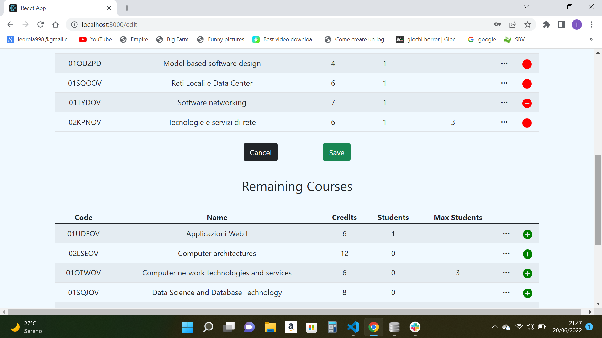

# Exam #1: "StudyPlan"
## Student: s301216 Leonardo Rolandi 

## React Client Application Routes

- Route `/`: general view of all the courses and eventually the studyPlan
- Route `/login`: page for log in, available only when not logged in
- Route `/add`: page for add a studyPlan, available only when logged in
- Route `/edit`:  page for edit a studyPlan, available only when logged in

## API Server

- URL:  `/api/courses`

Method: GET

Description: Get all the courses that the university offers.

Request body: None

Response: 200 OK (success) or 500 Internal Server Error (Database error).

Response body: An array of objects, each describing a course.
[{
    "code": "01TYMOV",
    "name": " Information systems security ",
    "credits": 12,
    "students": 0
    "maxStudents": null
    "incompatibleCourses": "01UDUOV"
    "preparatoryCourse": null
}, 
...
]

- URL:  `/api/studyplan`

Method: GET

Description: Get the studyplan of the student.

Request body: None

Response: 200 OK (success) or 500 Internal Server Error (Database error).

Response body: An array of objects, each describing the studyplan.
[{  "studentID": 100000,
    "code": "01OUZPD",
    "code": "01OUZPD",
    "name": "Model based software design",
    "credits": 4,
    "students": 1
    "maxStudents": null
    "incompatibleCourses": "null"
    "preparatoryCourse": null
}, 
...
]

- URL:  `/api/diffCourses`

Method: GET

Description: Get the remaining courses, given the studyPlan of the student.

Request body: None

Response: 200 OK (success) or 500 Internal Server Error (Database error).

Response body: An array of objects, each describing the remaining courses.
[{
    "code": "01TYMOV",
    "name": " Information systems security ",
    "credits": 12,
    "students": 0
    "maxStudents": null
    "incompatibleCourses": "01UDUOV"
    "preparatoryCourse": null
}, 
...
]

- URL: `/api/studyPlan`

Method: POST

Description: Add a studyplan to a student 

Request body: An array of objects, each describing the course to add in the studyplan
["02GOLOV","05BIDOV",...]

Response: `204 no content` (success) or `503 Service Unavailable` (generic error, e.g., when trying to insert an already existent course).If the request body is not valid, `422 Unprocessable Entity` (validation error).

Response body: None

- URL: `/api/courses`

Method: PUT

Description: Incrementing or decrementing the number of actual students of a course.

Request body: A flag representing the increment or the decrement 
[ 1 ]

Response: `204 no content` (success) or `503 Service Unavailable` (Database error while retrieving courses). If the request body is not valid, `422 Unprocessable Entity` (validation error).

Response body: None

- URL: `/api/users`

Method: PUT

Description: Update the career option of a student.

Request body: A number representing career option
[ 1 ]

Response: `204 no content` (success) or `503 Service Unavailable` (Database error while retrieving users). If the request body is not valid, `422 Unprocessable Entity` (validation error).

Response body: None

- URL: `/api/studyPlan/`

Method: DELETE

Description: Delete an existing studyplan from a student.

Request body: None

Response: `204 No Content` (success) or `503 Service Unavailable` (generic error).

Response body: None

## Database Tables

- Table `courses` - contains 	{code name credits students maxStudents incompatibleCourses preparatoryCourse}
- Table `studyPlans` - contains {studentID, code}
- Table `users` - contains {studentID email name surname password salt fullTime}

## Main React Components

- `MyCourseTable` (in `MyCourseTable.js`): table of all courses of university
- `MyAddStudyPlan` (in `MyAddStudyPlan.js`): form for select a type of studyPlan
- `MyEditDiffCourses` (in `MyEditDiffCourses.js`): table of the remaining courses outside of the studyPlan of a student
- `MyEditStudyPlan` (in `MyEditStudyPlan.js`): table of the studyPlan of a student
- `MyLogin` (in `MyLogin.js`): form for log in
- `MyNavbar` (in `MyNavbar.js`): navbar who comprends a log out function and a link to "\login"

## Screenshot

## Users Credentials
 |username(email)| password| studentID| name| surname| fullTime(1->fullTime, 0->partTime, null-> none)|
 |-------|----------|------|--------|--------|-----|
 |s100000@polibu.it| password3| s100000| francesco| russo| 1|
 |s100001@polibu.it| password4| s100001| mario| rossi| 0|
 |s100002@polibu.it| password5| s100002| sofia| ricci| 0|
 |s100003@polibu.it| password6| s100003| alice| bianchi| 0|
 |s100004@polibu.it| password7| s100004| gabriele| bruno| null|

